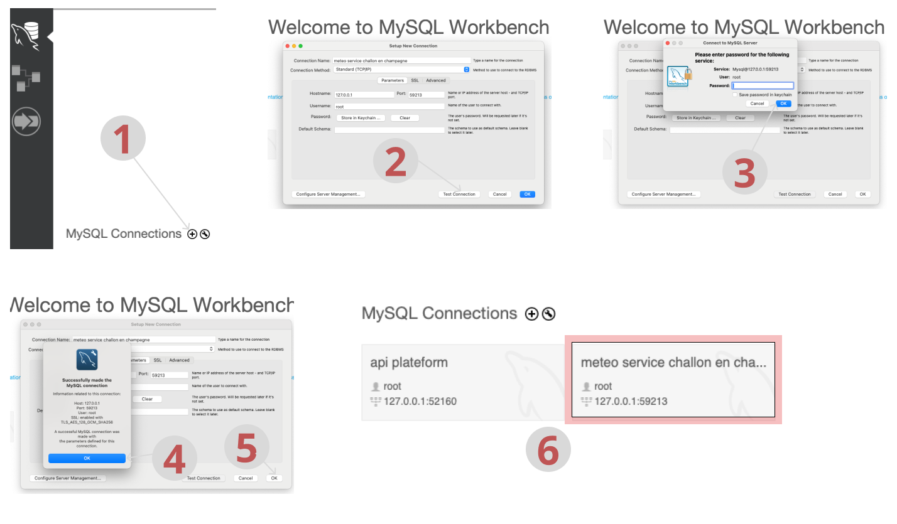

# Application Météo
## 
```bash
symfony console cache:clear
```

## Intégration de l'api Platform
```bash
composer require api
```

## Adresse crud
- on aura besoinde doctrine pour mapper les entité en table dans la base donnée,
- et de maker bundle pour créer des entités avec la ligne de commande
```bash
composer require symfony/orm-pack doctrine/doctrine-bundle
//et
composer require maker-bundle --dev
```
- apres avoir crée l'entité on genere 
```bash
symfony console doctrine:migrations:diff
symfony console doctrine:migrations:migrate

```

### Installation de docker
- installation de docker pour avoir un server mysql et gerer les interactions  entre la base de donné et l'application avec Mysql workbench
- creation du fichier compose.yaml, dans lequel se trouve les info de la base de donné.
- puis démarrage de server docker avec la commande
```bash
docker compose up
```

### Information importante de connexion à la base de donnée
- password: password
- database_name: meteo_db
- database_user: root
- database_password: password
- port: 59213
- ou cette commande pour plus de détail
```bash
symfony var:export --multiline
```
### Image de confguration mysql workbench

### Important:
A chaque fois que vous redémarrez docker, le numéro du port change, donc penser à mettre à jour ce numéro dans mysql workbench ou autre

# Relation entre user et adresse
lien doc => https://symfony.com/doc/current/doctrine/associations.html

### pour lier une adresse un utilisateur
{
  "name": "22 rue M"
  "personne": "/api/user1"
}


